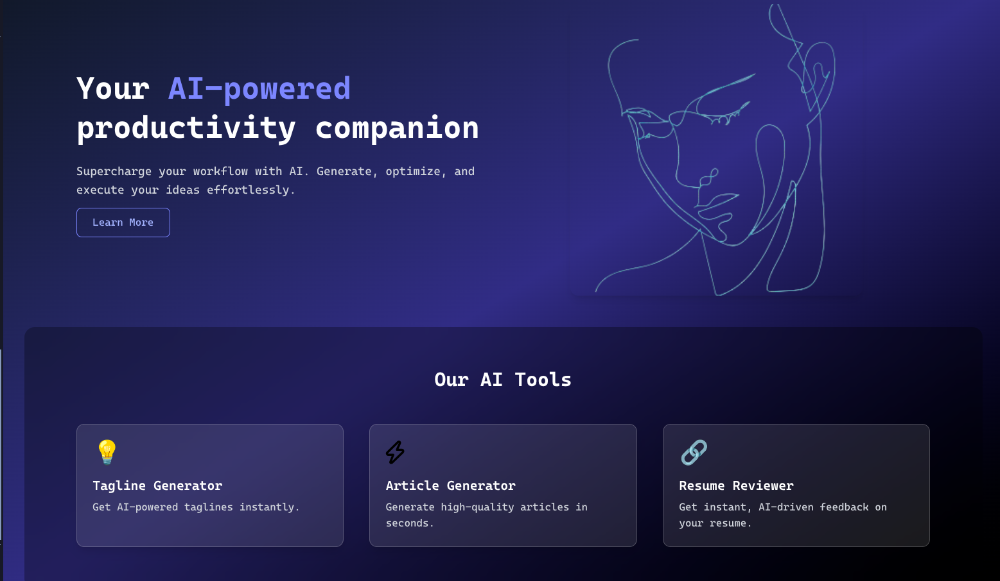
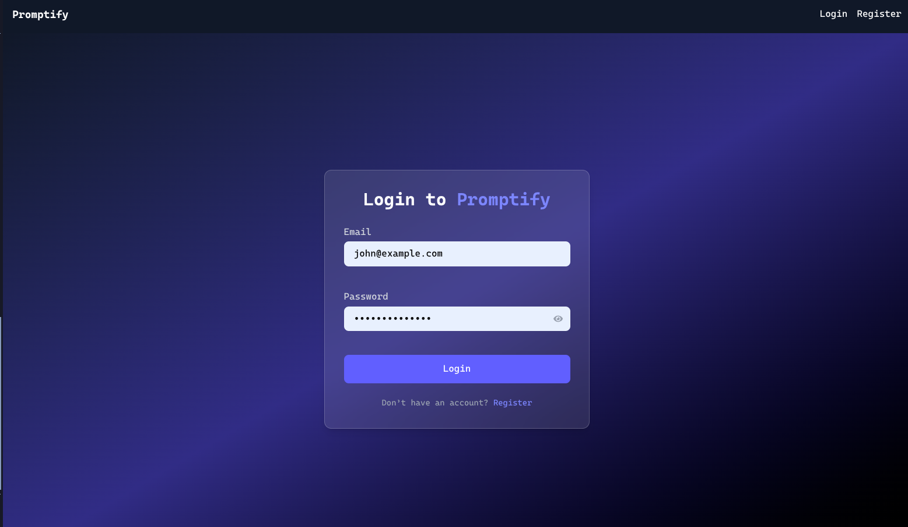
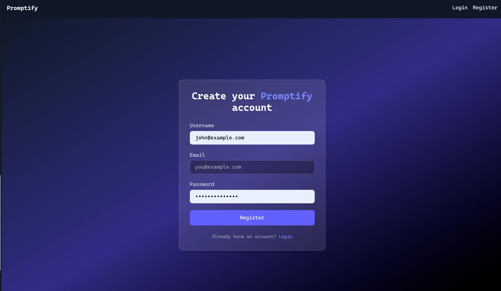
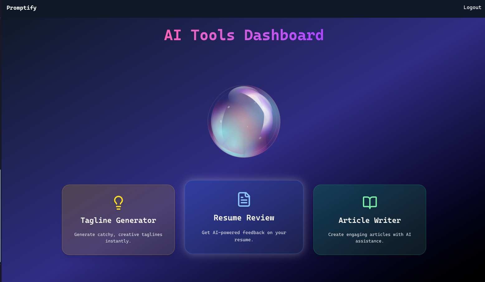
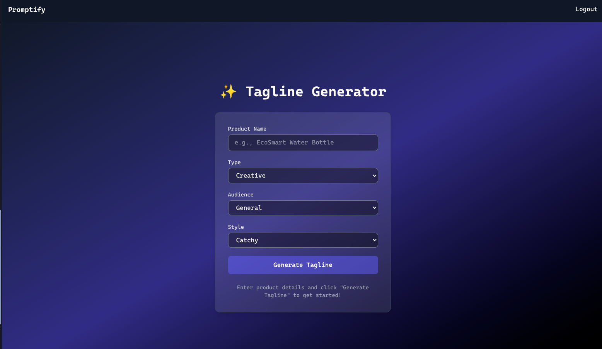
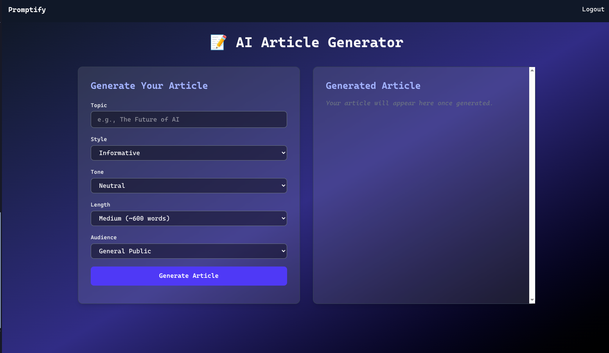
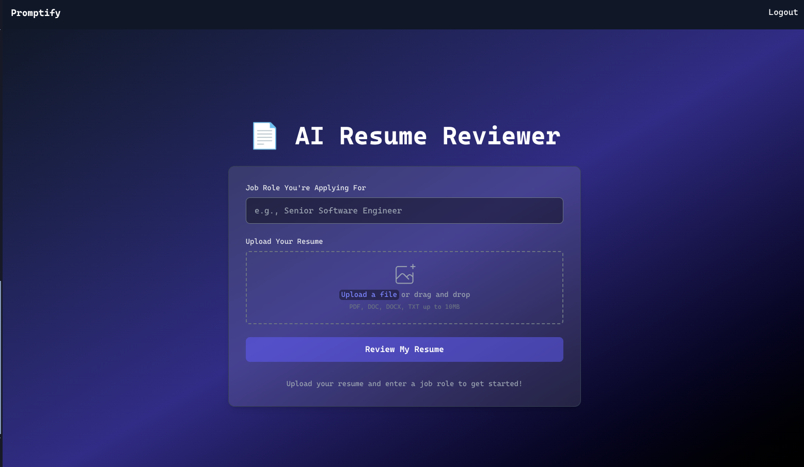

# AI Content Creation Suite — Tagline, Resume Review & Article Generation

A cutting-edge, full-stack AI platform that empowers users to effortlessly generate high-quality marketing taglines, receive intelligent resume reviews, and create engaging articles — all powered by advanced language models and seamless real-time streaming.

This project showcases modern web development expertise combined with state-of-the-art AI integration:

- **AI-Powered Creativity:** Users can generate creative taglines, get actionable resume feedback, and produce full-length articles — bridging the gap between human creativity and machine intelligence.
- **Real-Time Streaming Experience:** Leveraging Server-Sent Events (SSE), content streams live as it’s generated, providing an interactive, dynamic user experience with immediate feedback.
- **Robust & Secure Authentication:** Implements JWT-based authentication with access & refresh tokens, ensuring user data security and smooth session management.
- **Scalable & Maintainable Architecture:** Clean separation of concerns in frontend and backend, using industry best practices and modern libraries for state management, API handling, and animations.
- **Cross-Model AI Management:** Integrates multiple specialized AI models (Mistral for taglines, Phi3 for resumes, Llama3 for articles) using Ollama & Langchain, demonstrating advanced AI orchestration.

---

## 🌟 Key Features & Benefits

### 1. User Authentication & Security
- Secure user registration and login with hashed passwords (bcrypt).
- JWT-based access tokens with seamless refresh token flow.
- Middleware to protect routes and automatically handle token expiration.

### 2. AI-Driven Tagline Generator
- Input product details and receive instant, creative tagline suggestions.
- Supports customization of tagline type, audience, and style.
- Dynamic streaming of generated taglines using SSE for a smooth typing effect.

### 3. Intelligent Resume Review
- Upload resumes and get instant AI-powered insights on strengths and improvements.
- Real-time feedback delivered via streaming to minimize wait time.
- Tailored suggestions aligned with job market expectations.

### 4. Article Generation Tool
- Generate comprehensive, engaging articles on any topic.
- Utilizes powerful language models to produce coherent, polished content.
- Returns full text after generation for download or further editing.

---

## 🛠️ Technology Stack

### Backend
- **Node.js & Express:** API and real-time event streaming server.
- **MongoDB & Mongoose:** Secure user and token storage.
- **JWT & bcrypt:** Authentication and password security.
- **Ollama & Langchain:** AI orchestration, multi-model integration.
- **Server-Sent Events (SSE):** Real-time data streaming for instant user feedback.

### Frontend
- **React with Vite:** Modern, fast, and optimized SPA development.
- **Zustand:** Lightweight state management for auth tokens and app state.
- **TanStack Query:** Efficient and declarative API calls with caching.
- **Framer Motion:** Smooth, professional UI animations enhancing UX.
- **Tailwind CSS:** Responsive and customizable styling for a modern look.
### Monorepo
- **Turborepo** for managing the monorepo architecture and optimizing builds.

---

## 🎯 What Users Gain

- **Marketers & Entrepreneurs:** Generate impactful taglines to elevate brand identity.
- **Job Seekers:** Receive AI-driven resume critiques to improve job applications.
- **Content Creators & Bloggers:** Create compelling articles effortlessly, saving time and boosting creativity.
- **Developers & AI Enthusiasts:** Reference implementation of multi-model AI integration and SSE streaming in a real-world app.

---

## 💡 Key insights
- Demonstrates **full-stack mastery** with real-time backend streaming and sophisticated frontend state management.
- Showcases experience working with **cutting-edge AI tools** and model orchestration.
- Implements **robust security practices** including token refresh flows and error handling.
- Presents an **excellent user experience** powered by smooth animations and live feedback.
- Reflects ability to build **scalable, maintainable codebases** using modern JavaScript tooling and libraries.

---
## 📸 Preview

**Landing page**

**Dashboard**

**Article Generator**

**Tagline Generator**

**Resume Reviewer**

---
## ScreenShorts

  

  

